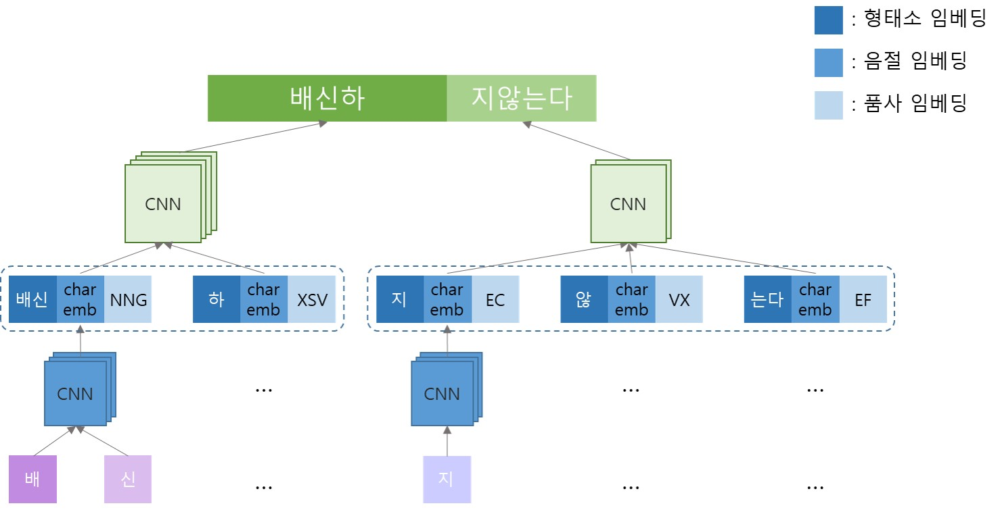
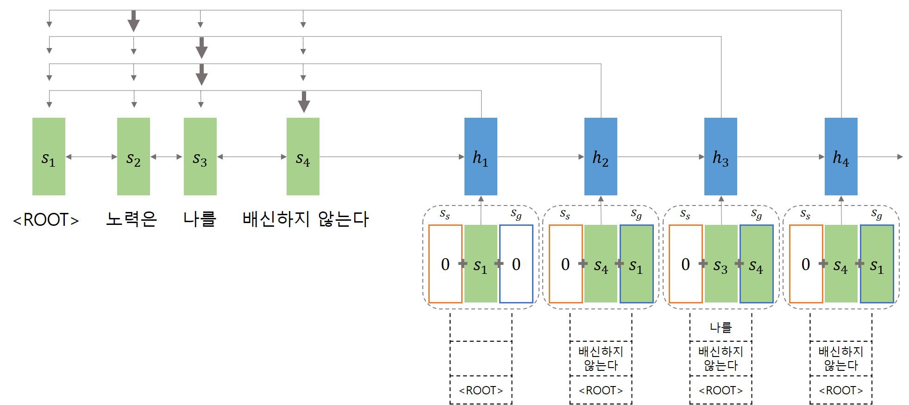

# Stack-Pointer Networks   for Korean Dpendency Parsing with Chunking

This project is about Korean dependency parsing with __chunking__.  
The code is based on the papers and codes below:
* Ma, X. et al. (2018). "Stack-Pointer Networks for Dependency Parsing", _In Proceedings of the 56th Annual Meeting of the Association for Computational Linguistics_, pp.1403-1414.  
  [ [paper](https://arxiv.org/pdf/1805.01087.pdf) ] [ [code](https://github.com/XuezheMax/NeuroNLP2) ]  
* Choi, Y. et al. (2019). "Korean Dependency Parser using Higher-order features and Stack-Pointer Networks", _In Journal of Korean Institute of Information Scientists and Engineers_, pp. 636-643.  
  [ [paper](http://www.dbpia.co.kr/journal/articleDetail?nodeId=NODE08750806&language=ko_KR) ] [ [code](https://github.com/yseokchoi/KoreanDependencyParserusingStackPointer) ]  
 

This code is updated from Choi's code to adapt to __Korean dependency parsing with chunking__.  
  

## Embedding strucutre(Sentence component unit)
  

* Input unit: sentence component
* Sentence component = content chunk + functional chunk
 

## Stack-pointer networks for Korean dependency parsing with chunking

 

## Data
### Used data
Korean Dependency Treebanks Reflected Chunking  
  [ [paper](https://github.com/aei0109/CV/tree/master/201910_HCLT) ] [ [code](https://github.com/aei0109/toChunk-based_DepCorpus) ] 

### Data format
#text = 따라서 행동의 변화를 의도적(planned)으로 변화를 시켜야만 학습이라고 할 수 있는 것이다.

ID | FORM(cont) | FORM(func) | LEMMA | UPOS | XPOS | CHUNKTAG | HEADS | DEPREL | MISC 
---| ---------- | ---------- | ----- | ---- | ---- | -------- | ----- | ------ | ---- 
1| 따라서| -| 따라서| SCONJ| MAJ| AX| 7| mark| -
2| 행동| 의| 행동 의| NOUN| NNG+JKG| NX+JMX| 3| nmod| -
3| 변화| 를| 변화 를| NOUN| NNG+JKO| NX+JKX| 6| obj| -
4| 의도_적_(_planned_)| 으로| 의도 적 ( planned ) 으로| NOUN| NNG+XSN+SS+SL+SS+JKB| NX+JKX| 6| obl| -
5| 변화| 를| 변화 를| NOUN| NNG+JKO| NX+JKX| 6| obj| -
6| 시키| 어야만| 시키 어야만| VERB| VV+EC| PX+ECX| 7| advcl| -
7| 학습_이| 라고_하_ㄹ_수_있_는_것_이_다_.| 학습 이 라고 하 ㄹ 수 있 는 것 이 다 .| VERB| NNG+VCP+EC+VV+ETM+NNB+VV+ETM+NNB+VCP+EF+SF| CX+PUX+EFX+SYX| 0| root| -

## Requirement
* python >= 3.6
* pytoch >= 0.4
(and other software like numpy etc.)

## Running the experiments
1. Training
2. Testing
